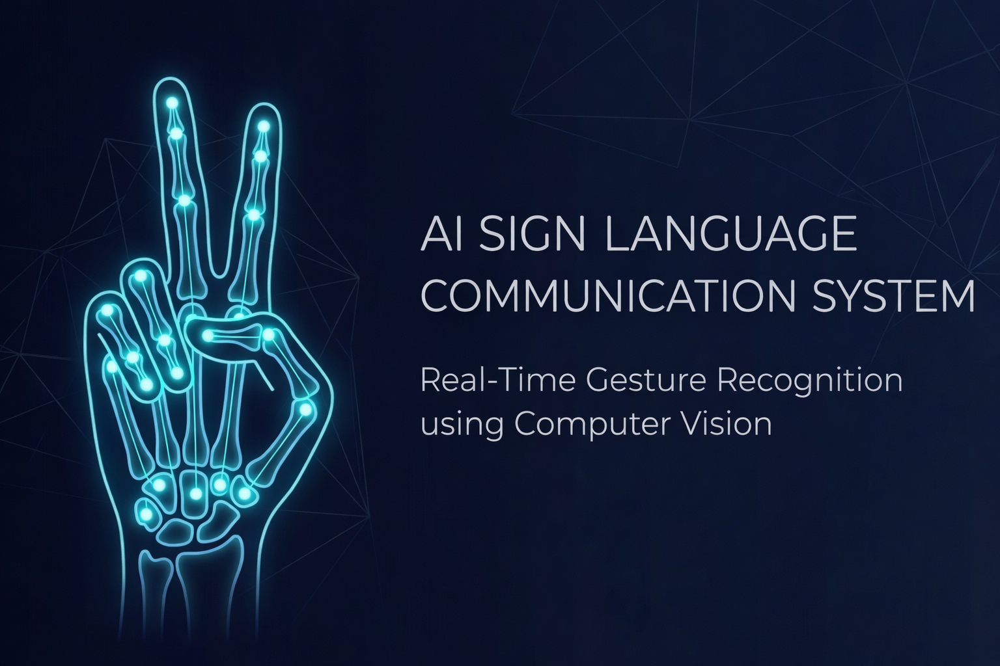
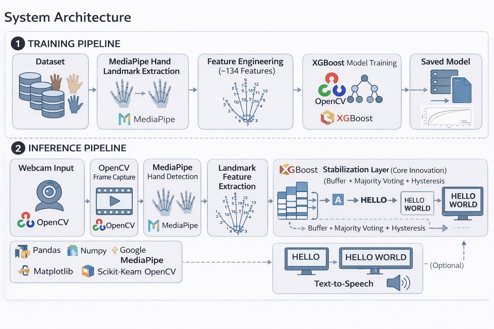

# 🚀 Real-Time Sign Language → Text Communication System


**Translates live ASL hand gestures into stable, real-time text — entirely on-device, with no cloud dependency.**

<br>



---

## Overview

The **AI Sign Language Communication System** is a production-quality, real-time pipeline that reads American Sign Language (ASL) gestures from a webcam and converts them into text output. It is not a demo classifier — it is a complete communication system engineered for stability, speed, and extensibility.

The pipeline runs MediaPipe Hands for 21-point landmark extraction, constructs a compact ~134-feature vector per frame, runs XGBoost inference, and passes predictions through a multi-stage stabilization layer to produce flicker-free output. Everything runs locally at 30+ FPS on standard hardware.

---

## Why This Matters

Over 430 million people worldwide have disabling hearing loss. For many, sign language is the primary mode of communication — yet most digital interfaces offer no native support for it. Real-time sign-to-text translation removes that barrier, enabling natural, low-friction communication in everyday contexts.

This system is designed to be that bridge: lightweight enough to run on a laptop, accurate enough to be useful, and modular enough to extend.

---

## How It Works

```
1. Webcam Input        →   Raw RGB video frames captured via OpenCV
2. Landmark Extraction →   MediaPipe Hands detects 21 3D keypoints per hand
3. Feature Engineering →   Keypoints normalized into ~134 stable geometric features
4. XGBoost Inference   →   Trained classifier maps feature vector to ASL letter
5. Stabilization       →   Buffer + majority voting + hysteresis smooth predictions
6. Text Output         →   Confirmed, stable character rendered to screen
```

---

## System Architecture



The system is composed of four decoupled stages. Each stage has a single responsibility and a clean interface to the next — making it easy to swap models, retrain on new data, or extend the output layer without touching unrelated components.

---

## Pipeline

```
Webcam
  │
  ▼
MediaPipe Hands ──► 21 3D landmarks per hand
  │
  ▼
Feature Engineering ──► ~134 normalized geometric features
  │
  ▼
XGBoost Classifier ──► Raw per-frame gesture prediction
  │
  ▼
Stabilization Layer ──► Buffer  +  Majority Vote  +  Hysteresis
  │
  ▼
Text Output ──► Stable, confirmed ASL character
```

---

## Key Engineering Challenge: Prediction Stability

### The Problem

A naive real-time classifier produces a new prediction every frame. At 30 FPS, even a well-trained model generates noisy label switches — minor hand tremor, lighting shifts, or transitional frames between signs cause rapid flickering between predicted characters. Raw predictions are unusable as text output.

### The Solution

A three-layer stabilization system sits between the classifier and the output:

| Layer | Mechanism | Effect |
|---|---|---|
| **Prediction Buffer** | Stores the last *N* frame predictions in a rolling window | Smooths over transient noise |
| **Majority Voting** | Commits a label only when it holds a supermajority in the buffer | Prevents false positives from brief mis-predictions |
| **Hysteresis** | Requires the active label to be consistently challenged before switching | Prevents rapid oscillation at gesture boundaries |

The result is stable, human-readable output that responds naturally to intentional gesture changes — without jitter or flicker.

---

## Features

- **Real-time ASL alphabet recognition** — Full A–Z gesture set at 30+ FPS
- **Stable predictions** — No flicker; buffer + majority voting + hysteresis throughout
- **Lightweight inference** — XGBoost over engineered features; no GPU or deep learning required
- **Fully local** — Zero cloud dependency; runs entirely on-device
- **Modular architecture** — Vision, ML, and inference layers are cleanly separated and independently replaceable

---

## Tech Stack

| Layer | Technology |
|---|---|
| Language | Python 3.9+ |
| Computer Vision | OpenCV 4.x |
| Landmark Detection | MediaPipe Hands |
| ML Classifier | XGBoost |
| Feature Processing | NumPy, Pandas |

---

## Project Structure

```
ai-sign-language-communication-system/
│
├── assets/
│   ├── banner.png
│   ├── system_architecture.png
│   └── demo.gif
│
├── data/                    # Collected gesture samples and class labels
│
├── ml/                      # Model training, evaluation, and serialization
│
├── inference/               # Real-time inference engine and stabilization logic
│
├── vision/
│   └── hand_detector.py     # MediaPipe landmark extraction and feature engineering
│
├── app.py                   # Application entry point
├── requirements.txt
└── README.md
```

---

## Installation

**Prerequisites:** Python 3.9+, a connected webcam, pip

```bash
# 1. Clone the repository
git clone https://github.com/Rakshith-web-dev/ai-sign-language-communication-system.git
cd ai-sign-language-communication-system

# 2. Create and activate a virtual environment
python3 -m venv venv
source venv/bin/activate        # Windows: venv\Scripts\activate

# 3. Install dependencies
pip install -r requirements.txt
```

---

## Running the System

```bash
# Launch the full application
python app.py

# Run gesture detection in isolation (headless)
python vision/hand_detector.py
```

---

## System Design Highlights

**Low-latency inference** — XGBoost over a compact, normalized feature vector keeps per-frame compute minimal. No heavy model loading; no GPU bottleneck. Sustained 30+ FPS on standard laptop hardware.

**Stable output** — The stabilization layer fully decouples raw model predictions from user-facing text. The classifier can flicker internally; the output never will.

**Modular architecture** — `vision/`, `ml/`, and `inference/` are independent modules with clean boundaries. Swapping the classifier, retraining on an extended dataset, or adding a new output modality requires changes to exactly one module.

**Reusable pipeline** — Feature engineering and the inference engine are designed as standalone components. Adapting this system to a new gesture vocabulary or a different sign language requires only new training data and a retrained model.

---

## What's Next: Letters → Words → Sentences

The current system recognizes individual ASL letters with high stability. The natural evolution is upward in linguistic scope:

```
H → E → L → L → O  →  "HELLO"
```

Rather than treating each prediction in isolation, the next stage buffers confirmed characters, applies gesture-to-word segmentation logic, and assembles them into words — and eventually sentences. This transforms the system from a character recognizer into a full communication interface.

---

## Roadmap

| Phase | Description | Status |
|---|---|---|
| **Phase 1** | Real-time ASL alphabet recognition (A–Z) | ✅ Complete |
| **Phase 2** | Word formation from confirmed gesture sequences | 🔄 In Progress |
| **Phase 3** | Sentence formation and context assembly | 🔜 Planned |
| **Phase 4** | Continuous real-time communication system | 🔜 Planned |

---

## Author

**Rakshith G M**  
Software Engineer — Computer Vision & ML Systems

[](https://github.com/Rakshith-web-dev)
[](https://www.linkedin.com/in/rakshith-g-m/)

---

## License

This project is intended for educational and research purposes only. It is not licensed for commercial use or redistribution. If you use this work in academic research, please provide appropriate attribution.

---

<p align="center">Built to make communication more accessible.</p>