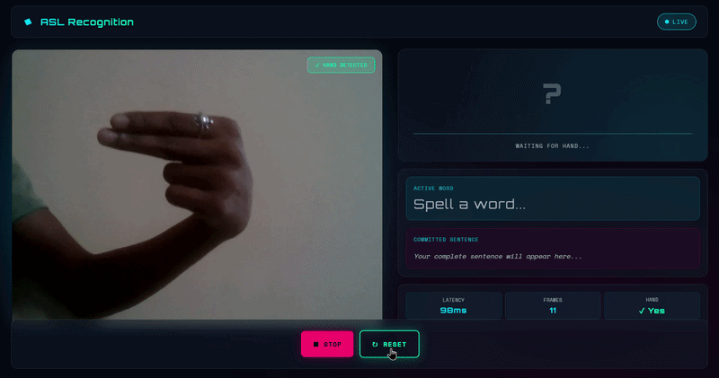

🚀 Real-Time Sign Language Recognition System


Production-grade ASL-to-text system delivering stable, real-time translation at 30+ FPS with sub-60ms latency.

---

## Overview

End-to-end system that converts American Sign Language hand gestures into stable text and optional speech. No cloud dependency. Runs entirely on-device.

This system is designed to solve a core limitation of real-time ML systems: unstable frame-level predictions that are unusable without post-processing.

**What makes it work:**
- MediaPipe Hands for 21-point landmark detection
- Normalized 134-D feature space
- XGBoost classifier (26-class A–Z problem)
- Three-layer stabilization (buffer + voting + hysteresis)
- Character state machine + word assembly

---

## Why This Matters

430+ million people worldwide rely on sign language. Most digital systems don't support it. This project provides a lightweight, fully-local solution with zero infrastructure requirements.

---

## Demo



---

## System Architecture


A decoupled, real-time architecture ensures low latency, modularity, and production readiness.

| Stage | Purpose |
|-------|---------|
| **Vision** | 21-point landmark extraction & normalization |
| **Inference** | XGBoost classification (2-3ms) |
| **Stabilization** | Three-layer noise filtering |
| **Language** | Character accumulation → words → sentences |

Each stage has clean interfaces. Swap the classifier, retrain, or tune thresholds independently.

---

## Real-Time Pipeline

Webcam → MediaPipe Hands → Feature Engineering (134-D) → XGBoost Prediction → Confidence Gate → Sliding Buffer + Majority Vote → Hysteresis Lock → State Machine (prevent duplicates) → Word Buffer → Sentence Formation → Display / TTS

**Latency:** ~50-60ms end-to-end (capture → display)

---

## How Stabilization Works

### Layer 1: Confidence Gate
Only high-confidence predictions buffer. Low-confidence frames suppressed.

### Layer 2: Majority Vote
Rolling 7-frame window. Display the statistical mode (~233ms smoothing).

### Layer 3: Hysteresis
New letter only displays after holding steady for 4+ frames (~130ms). Prevents flicker at boundaries.

**Result:** Stable output even when classifier internally fluctuates.

**Key Insight:** Raw model accuracy is not the bottleneck in real-time systems—prediction stability is. This system prioritizes stability over per-frame accuracy.

---

## Character State Machine

- **Hold time (0.6s):** Gesture must be held 600ms before acceptance
- **Repeat cooldown (1.2s):** Enables intentional doubled letters ("HELLO" → L-hold-L-repeat)
- **Prevents:** Accidental duplicates from hand tremor
- **Enables:** Natural repeated character input

---

## Word & Sentence Formation

- **Space:** Hand absent >1s → word break
- **Sentence:** Hand absent >3s → finalize sentence
- **Method:** Time-based triggers (space is implicit in ASL)

---

## Key Innovations

### Orientation-Invariant
Normalize left-hand signs to right-hand geometry. Single model handles both. Training data cut in half.

### Normalized Feature Space
Wrist-origin + middle-MCP-scale normalization removes position/size variation. Model sees only gesture geometry.

### 134-D Vector
| Group | Count | Purpose |
|-------|-------|---------|
| Normalized coords | 63 | All 21 landmarks (wrist-relative) |
| Pairwise distances | 20 | Tip spreads, reach distances |
| Joint angles | 20 | Finger bends, knuckle angles |
| Palm-relative | 20 | Distance to centroid |
| Shape descriptors | 3 | Aspect ratio, extension, orientation |
| Discriminative | 8 | T↔A, M↔N↔S separation |

### CPU-Only Inference
XGBoost (not deep learning):
- 2-3ms per frame
- 50MB model
- Deterministic
- No GPU required

Why? Gesture classification is spatial, not temporal. Recurrent models add latency without accuracy gain.

---

## Features

- Full A–Z recognition at 30 FPS
- Flicker-free predictions via three-layer stabilization
- Prevents duplicate characters naturally
- Sentence-level output with word formation
- On-demand TTS (manual trigger)
- <60ms latency capture-to-display
- CPU-only (no GPU required)
- Fully local (no cloud)
- Production API with health checks
- React frontend with animations

---

## Tech Stack

| Component | Technology |
|-----------|-----------|
| Frontend | React 18 (Vite) |
| Backend | FastAPI |
| Vision | MediaPipe + OpenCV |
| ML Model | XGBoost |
| Speech | Edge TTS |
| Containerization | Docker + Compose |
| Reverse Proxy | Nginx |

---

## Project Structure

```
ai-sign-language-communication-system/
├── backend/
│   ├── core/
│   │   ├── inference/     # Predictor, stabilizer, text_builder
│   │   ├── ml/            # Feature engineering
│   │   └── vision/        # Hand detection
│   ├── routers/           # API endpoints
│   ├── main.py
│   └── requirements.txt
├── frontend/
│   ├── src/
│   │   ├── components/    # Video, display, control
│   │   ├── hooks/         # Stream, prediction, text
│   │   └── App.jsx
│   ├── package.json
│   └── vite.config.js
├── models/
│   ├── asl_xgboost.pkl
│   └── label_encoder.pkl
├── nginx/
│   └── nginx.conf
└── docker-compose.yml
```

---

## Getting Started

### Prerequisites
- Python 3.9+
- Node.js 16+
- Webcam

### Development

**Backend:**
```bash
cd backend
python3 -m venv venv && source venv/bin/activate
pip install -r requirements.txt
uvicorn main:app --reload --port 8000
```

**Frontend:**
```bash
cd frontend
npm install && npm run dev
```

Open `http://localhost:5173`

### Production
```bash
docker-compose up --build
```

---

## API Reference

### POST `/predict`
```json
Request: { "frame": "base64...", "timestamp": 1698765432 }
Response: { "letter": "H", "confidence": 0.87, "hand_detected": true }
```

### POST `/speak`
```json
Request: { "text": "HELLO" }
Response: { "status": "synthesized", "duration_seconds": 0.8 }
```

### GET `/health`
```json
Response: { "status": "healthy", "model_loaded": true }
```

---

## Performance

| Metric | Value |
|--------|-------|
| Frame rate | 30 FPS |
| Inference latency | 10-15ms |
| End-to-end latency | 50-60ms |
| Model size | 50MB |
| Memory usage | 180-250MB |
| CPU utilization | 8-12% |
| Test accuracy | >90% |

---

## System Design Principles

**Decoupled stages:** Vision, inference, stabilization, language independently modular.

**Stateless prediction:** No temporal state. Frame-independent processing enables simple scaling.

**Three-layer stabilization:** Orthogonal noise filters at different timescales. Each independently tunable.

**Normalized geometry:** Position/size variation removed. Model learns only gesture shape.

**Time-based language:** Implicit space/sentence detection. No explicit punctuation gesture needed.

---

## Future Work

- Temporal modeling (LSTM for gesture sequences)
- ASL grammar parser (syntax rules, context)
- Multi-hand support + body pose
- Mobile deployment (TFLite quantization)
- In-browser inference (WebAssembly)

---

## Troubleshooting

| Issue | Solution |
|-------|----------|
| Noisy predictions | Increase `STABILITY_THRESHOLD` or `BUFFER_SIZE` |
| High latency | Check network, verify CPU not saturated |
| Low accuracy | Ensure consistent lighting, background, gesture form |
| Webcam not detected | Check browser permissions, try incognito mode |

---

## References

- MediaPipe: Bazarevsky et al., 2020 — https://arxiv.org/abs/2006.10214
- XGBoost: Chen & Guestrin, 2016 — https://arxiv.org/abs/1603.02754
- ASL Dataset: Kowalski et al., 2021 — https://www.kaggle.com/datasets/grassknoted/asl-alphabet

---

## License

Educational and research use only. Not for commercial deployment. Attribution required if published.

---

## Author

**Rakshith G M** — Software Engineer, Computer Vision & ML

[](https://github.com/Rakshith-G-M)
[](https://www.linkedin.com/in/rakshith-g-m/)

---

<p align="center">
  <em>Building real-time AI systems for accessible communication.</em>
</p>