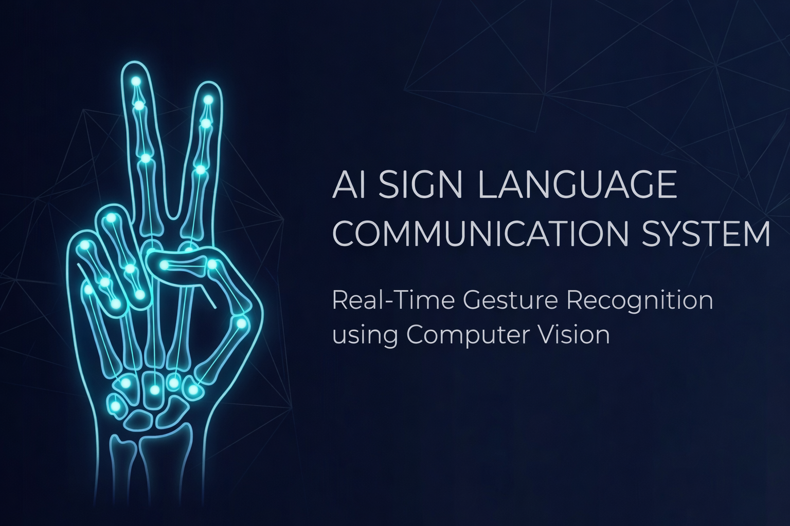
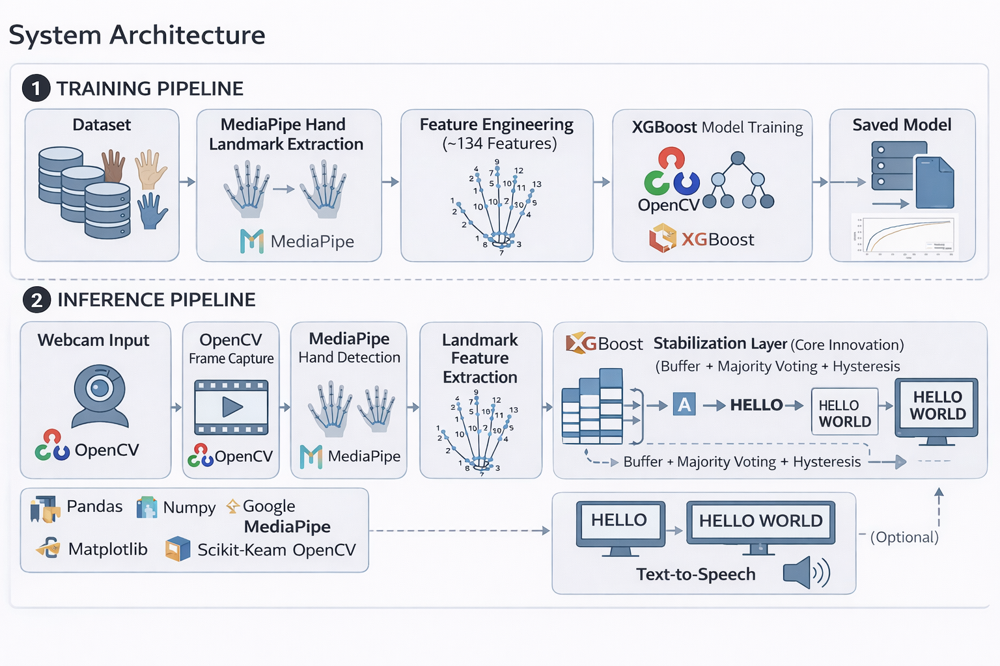

# SignFlow — AI-Based Sign Language Recognition & Communication System




SignFlow is a production-ready, AI-powered real-time American Sign Language (ASL) recognition and communication platform. It translates ASL finger-spelling (A–Z) into text and speech, empowering seamless accessibility. 

**Note:** This system utilizes a high-speed, **STATIC alphabet recognition** pipeline exclusively, enabling exceptionally low-latency performance on edge and cloud setups.

---

## Live Demo

*   **Frontend Dashboard:** [https://signflow-ecru.vercel.app](https://signflow-ecru.vercel.app)
*   **Backend API:** [https://signflow-h42u.onrender.com](https://signflow-h42u.onrender.com)

---

## Features

*   📷 **Real-time webcam recognition:** In-browser high-performance camera capture.
*   🖐️ **MediaPipe hand landmarks:** Sub-pixel precise 21-point spatial extraction.
*   🧠 **XGBoost classifier:** Ultra-fast, lightweight A–Z spatial classification.
*   ⚖️ **Prediction stabilization:** Robust filtering to eliminate frame flicker.
*   📝 **Word builder:** Automatic time-based letter accumulation and spacing.
*   🏗️ **Sentence builder:** Contextual assembly of complete phrases.
*   🪄 **SymSpell spell correction:** Real-time typo and duplicate correction.
*   🔊 **Edge-TTS speech:** High-fidelity, natural-sounding audio synthesis.
*   💻 **Responsive React dashboard:** Premium, modern UI with Framer Motion.
*   🔌 **REST API:** Clean, well-documented endpoints for external integration.
*   👥 **Multi-session backend:** Secure, stateless concurrent session handling.
*   ☁️ **Cloud deployment:** Fully containerized and deployed to Render and Vercel.

---

## Architecture



The core strength of SignFlow is its robust prediction stabilization and language assembly pipeline:

```text
Camera
↓
MediaPipe Hands
↓
Landmark Extraction
↓
Feature Engineering
↓
XGBoost Classifier
↓
Prediction Stabilizer
↓
Text Builder
↓
Sentence Builder
↓
Edge-TTS
↓
React Dashboard
```

---

## Technology Stack

### Backend
| Technology | Role |
| :--- | :--- |
| **Python** | Core runtime environment |
| **FastAPI** | High-performance REST framework |
| **MediaPipe** | Hand tracking and landmark mapping |
| **OpenCV** | Image processing and frame decoding |
| **XGBoost** | Gradient-boosted inference model |
| **Scikit-learn** | Feature normalization and preprocessing |
| **SymSpell** | Fast symmetric delete autocorrection |
| **Edge-TTS** | Cognitive text-to-speech engine |

### Frontend
| Technology | Role |
| :--- | :--- |
| **React** | Component-driven UI framework |
| **TypeScript** | Strict type-safety across the client |
| **Vite** | Lightning-fast build tooling |
| **TailwindCSS** | Utility-first responsive styling |
| **Framer Motion** | Fluid animations and transitions |
| **TanStack Query** | Asynchronous server state management |

### Deployment
| Component | Platform |
| :--- | :--- |
| **Frontend** | **Vercel** (Edge CDN) |
| **Backend** | **Render** (Containerized Docker deployment) |

---

## Project Structure

```
ai-sign-language-communication-system/
├── backend/
│   ├── core/
│   │   ├── inference/
│   │   │   ├── prediction_session.py
│   │   │   ├── realtime_asl_predictor.py
│   │   │   └── text_builder.py
│   │   ├── ml/
│   │   │   ├── constants.py
│   │   │   ├── dataset_validation.py
│   │   │   ├── feature_engineering.py
│   │   │   ├── landmark_utils.py
│   │   │   ├── train_asl_xgboost.py
│   │   │   └── training_utils.py
│   │   ├── vision/
│   │   │   ├── hand_detector.py
│   │   │   └── landmark_extractor.py
│   │   ├── config.py
│   │   ├── dependencies.py
│   │   ├── exceptions.py
│   │   ├── logging_config.py
│   │   └── middleware.py
│   ├── routers/
│   │   └── prediction.py
│   ├── schemas/
│   │   ├── common.py
│   │   ├── health.py
│   │   └── prediction.py
│   ├── services/
│   │   ├── prediction_service.py
│   │   └── tts_service.py
│   ├── tests/
│   ├── Dockerfile
│   ├── main.py
│   └── requirements.txt
├── frontend/
│   ├── public/
│   ├── src/
│   │   ├── app/
│   │   ├── components/
│   │   ├── features/
│   │   ├── layouts/
│   │   ├── lib/
│   │   ├── pages/
│   │   ├── styles/
│   │   ├── main.tsx
│   │   └── vite-env.d.ts
│   ├── Dockerfile
│   ├── index.html
│   ├── nginx.spa.conf
│   ├── package.json
│   ├── tailwind.config.js
│   ├── tsconfig.json
│   └── vite.config.ts
├── models/
│   ├── asl_xgboost.pkl
│   └── label_encoder.pkl
├── nginx/
│   └── nginx.conf
├── assets/
│   ├── banner.png
│   ├── demo.gif
│   ├── system_architecture.png
│   └── ui-screenshot.png
└── docker-compose.yml
```

---

## Screenshots

### Dashboard & Prediction Interface

*Figure 1: The real-time interactive prediction dashboard interface.*


---

## Performance

*   **Average End-to-End Latency:** **≈600 ms** on a free-tier cloud deployment.
*   **Analysis:** Because the optimized XGBoost model requires less than 5ms for spatial inference locally, the latency overhead is dominated almost entirely by network transmission round-trips to the cloud infrastructure.

---

## Security

*   🛡️ **Input Validation:** Strict Pydantic and Zod schemas block malformed data and corrupted payloads.
*   📤 **Upload Limits:** Enforced image frame size limits to prevent server resource and bandwidth exhaustion.
*   🔑 **UUID Session IDs:** Isolated, cryptographically secure UUIDs for reliable and isolated prediction state tracking.
*   🌐 **Restricted CORS:** Backend APIs explicitly restrict cross-origin policies for secure frontend access.
*   📋 **Safe Error Handling:** All server-side stack traces are filtered and sanitized before reaching the client response.

---

## Deployment

*   **Frontend Deployment:** Hosted natively on **Vercel** with integrated Edge CDN.
*   **Backend Deployment:** Hosted on **Render** via Docker Containerization.

### Deployment Instructions

#### Vercel (Frontend)
1. Link your GitHub repository to a new Vercel project.
2. Select the framework preset as **Vite**.
3. Set the Root Directory to `frontend`.
4. Deploy the application.

#### Render (Backend)
1. Create a new Web Service on Render and link the GitHub repository.
2. Select **Docker** as the runtime environment.
3. Set the Docker Build Context to the `backend` directory.
4. Deploy the web service.

---

## Future Work

*   **Offline Inference:** Migrating the classification pipeline entirely to the client browser using WebAssembly.
*   **Sentence-level Translation:** Incorporating LLM grammar structurers to map disjointed ASL words to formal English syntax.
*   **Transformer Models:** Exploring lightweight sequence transformers for deeper contextual understanding.
*   **Mobile Application:** Wrapping the dashboard within a React Native application for native mobile performance.
*   **Multi-language Speech Synthesis:** Broadening Edge-TTS locale options for cross-lingual accessibility.

<br>

---
<div align="center">

## Thank you for visiting SignFlow! 

If you found this project interesting, feel free to connect with me.

<br>

<p align="center">
  <a href="https://github.com/Rakshith-G-M">
    
  </a>
  &nbsp;&nbsp;
  <a href="https://www.linkedin.com/in/rakshith-g-m/">
    
  </a>
</p>

</div>

---
## License

Educational and research use only. Not for commercial deployment. Attribution required if published.